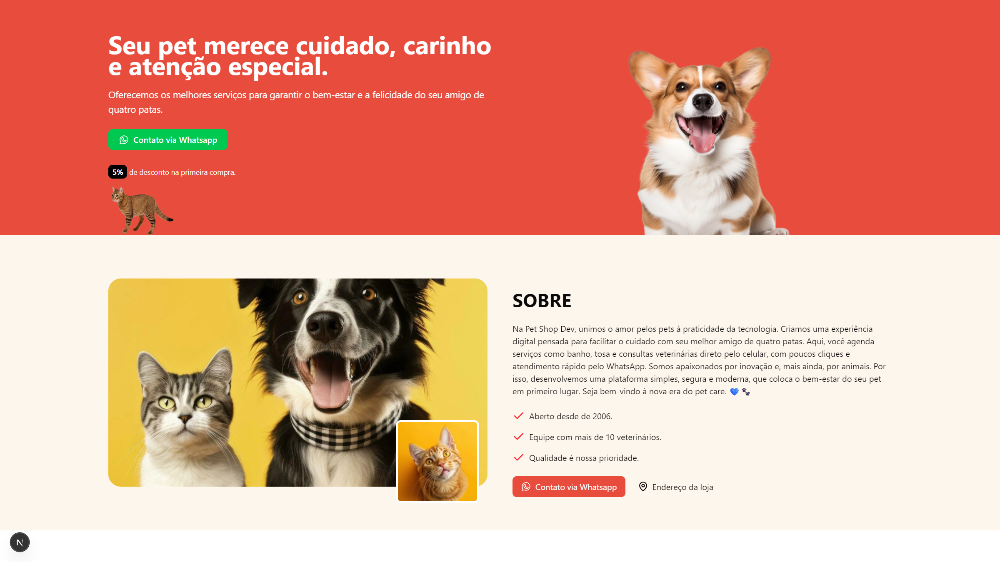

# 🚀 Pet Shop Dev - Landing Page



> Landing page moderna e responsiva para um Pet Shop, desenvolvida com Next.js e Tailwind CSS. O projeto demonstra o uso de componentes reutilizáveis, animações e carrosséis interativos para criar uma experiência de usuário envolvente.

### 🔗 [Acesse a Demo Ao Vivo](https://petdev-landing-nextjs.vercel.app/)

---

### ✨ Funcionalidades Principais

- **Design Responsivo:** Layout totalmente adaptado para uma experiência de usuário otimizada em desktops, tablets e celulares.
- **Animações de Scroll:** Efeitos de fade e slide ao rolar a página, implementados com a biblioteca AOS para dar mais dinamismo à navegação.
- **Carrosséis Interativos:** Carrosséis para "Serviços" e "Depoimentos" construídos com Embla Carousel, com navegação por botões e navegação por toque.
- **Componentização com React:** Estrutura organizada em componentes reutilizáveis para cada seção da página (Hero, Sobre, Serviços, etc.), seguindo as melhores práticas do React.
- **Otimização de Fontes e Imagens:** Uso de next/font (com a fonte Geist) e next/image para garantir a melhor performance e carregamento rápido.
- **Contato Rápido:** Botões de "Fale no WhatsApp" com links pré-formatados que facilitam o contato do cliente diretamente do site.

---

### 🛠️ Tecnologias Utilizadas

- **Framework:** Next.js
- **Linguagem:** TypeScript
- **Estilização:** Tailwind CSS
- **Componentes UI:** Radix UI, Lucide React, Phosphor Icons
- **Carrossel:** Embla Carousel
- **Animações:** AOS (Animate On Scroll)
- **Utilitários:** clsx & tailwind-merge

---

### 🔧 Como Rodar o Projeto

```bash
# 1. Clone o repositório
# Substitua pela URL do seu repositório
git clone https://github.com/alanborgesdev/petdev-landing-nextjs

# 2. Navegue até o diretório do projeto
cd petdev-landing-nextjs

# 3. Instale as dependências
npm install

# 4. Rode o servidor de desenvolvimento
npm run dev

# 5. Abra http://localhost:3000 no seu navegador para ver o resultado.
```
---

### 💡 Desafios e Aprendizados

Durante o desenvolvimento deste projeto, enfrentei alguns desafios interessantes que me proporcionaram grandes aprendizados:

-   **Configuração do Carrossel:** Integrar e estilizar o `Embla Carousel` foi um desafio gratificante. Aprendi a utilizar seus hooks para controlar o estado do carrossel de forma programática, o que me deu um entendimento mais profundo sobre como bibliotecas de UI interagem com o React.
-   **Animações com AOS:** Garantir que as animações de scroll funcionassem de forma consistente em todos os componentes e não impactassem a performance foi um ponto de atenção. Isso me ensinou sobre a importância do atributo `once: true` para otimizar a experiência do usuário.

---

### 👤 Autor  

Este projeto foi desenvolvido por **[Alan Borges](https://github.com/alanborgesdev)**

O projeto foi construído com base no tutorial [Criar LANDING PAGE profissional do ZERO + Next JS](https://www.youtube.com/watch?v=s_hYl2b4Ias) do canal **[Sujeito Programador](https://www.youtube.com/@sujeitoprogramador)**, como forma de praticar e solidificar conceitos de desenvolvimento front-end com Next.js, TypeScript e Tailwind CSS.

---

### 📝 Licença

O código-fonte deste projeto está licenciado sob a [Licença MIT](LICENSE).